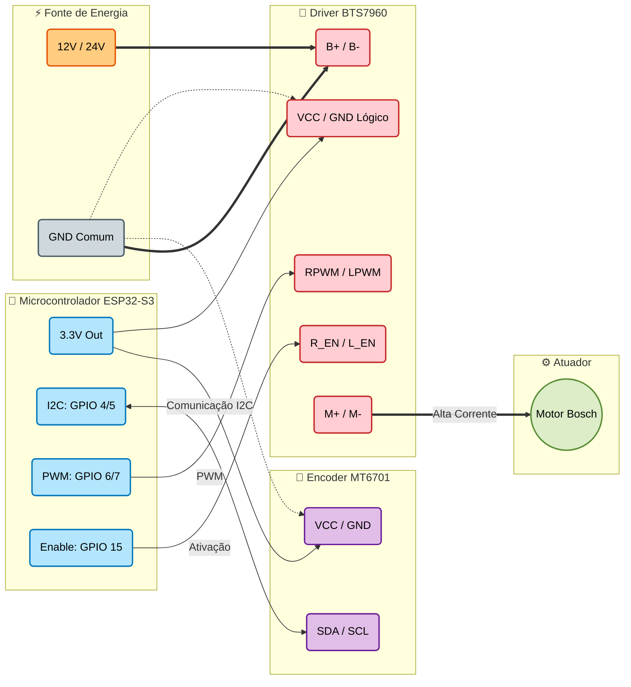

# 📡 Controlador de Rotor de Antena - ESP32a

> **Sistema de posicionamento de precisão para antenas VHF/UHF com interface web, controle PID ## 📄 Termos de Uso (Licença)

Este projeto é disponibilizado gratuitamente para a comunidade de radioamadores e hobbistas.

- ✅ **Permitido**: Uso pessoal, educacional e modificações para uso próprio.
- ❌ **Proibido**: Uso comercial, venda de kits baseados neste código ou monetização direta/indireta sem autorização prévia.

## 🔌 API Reference (Para Integrações) proteção avançada contra torção de cabos.**

## ⚡ Destaques do Projeto

- **🎯 Alta Precisão**: Encoder Magnético MT6701 (14-bit) com algoritmo de controle PID adaptativo.
- **🛡️ Segurança Ativa**: Sistema anti-torção com limites absolutos de ±180° e recuperação automática inteligente.
- **🌐 Interface Moderna**: Controle total via Browser (Mobile/Desktop) usando WebSocket em tempo real.
- **📶 Conectividade**: Configuração simplificada via WiFiManager (Portal Captivo) e suporte a mDNS.
- **💾 Persistência**: Salvamento automático de posição e calibração na memória NVS.

## 🛠️ Stack Tecnológico

| Componente | Especificação | Função |
|------------|---------------|--------|
| **MCU** | ESP32-S3 | Processamento Dual-core & WiFi |
| **Sensor** | MT6701 | Leitura de posição absoluta (I2C) |
| **Driver** | BTS7960 | Controle de potência do motor (43A) |
| **Motor** | Bosch FPG 12V 0 130 | Vidro Elétrico (Alto Torque/Redução) |

### Pinagem (Padrão)
- **I2C**: SDA (`GPIO 4`), SCL (`GPIO 5`)
- **Motor**: RPWM (`GPIO 6`), LPWM (`GPIO 7`), EN (`GPIO 15`)

## � Diagrama de Ligação

## �🚀 Quick Start

1. **Setup de Ambiente**
   - Instale VS Code + PlatformIO ou Arduino IDE.
   - Dependências: `WiFiManager`, `ESPAsyncWebServer`, `ArduinoJson`.

2. **Deploy**
   - Clone o projeto e realize o upload para o ESP32-S3.

3. **Configuração**
   - Conecte-se à rede WiFi gerada: `RotorAntena-Config`.
   - Configure sua rede WiFi local no portal.

4. **Uso**
   - Acesse `http://rotorantena.local` no navegador.
   - Aponte a antena para o Norte e clique em **"Calibrar Zero"**.

## 🧠 Lógica de Proteção (Anti-Torção)

O sistema implementa uma lógica estrita para proteger o cabeamento coaxial:

1. **Limites Absolutos**: O rotor opera estritamente entre -180° e +180°.
2. **Roteamento Inteligente**: 
   - Se o alvo está dentro do alcance direto: Vai pelo caminho mais curto.
   - Se o caminho curto causaria torção (ex: passar de +180°): O sistema inverte a rota automaticamente (caminho longo seguro).
3. **Recuperação de Vento**: Se forças externas moverem a antena para fora dos limites (ex: +181°), o sistema bloqueia movimentos inseguros e força o retorno para a zona segura.

## � Website Embarcado (Dashboard)

O sistema possui um **servidor web completo** rodando dentro do chip ESP32. Não é apenas uma API, mas uma interface gráfica rica e interativa.

A interface oferece:
- **🧭 Bússola em Tempo Real**: O ponteiro na tela segue exatamente o movimento da antena com animação fluida (WebSockets).
- **🎛️ Painel de Controle**: 
  - Slider de precisão para escolha de ângulo.
  - Botões táteis para ajuste fino manual (Esquerda/Direita).
  - Presets rápidos de direção.
- **📱 100% Responsivo**: Funciona como um aplicativo nativo no celular, tablet ou computador.

## �🔌 API Reference (Para Integrações)

Controle o rotor via HTTP para integrações (ex: N1MM, Ham Radio Deluxe):

- `GET /api/status` - Retorna JSON com telemetria completa.
- `POST /api/setangle` - Define azimute alvo (Payload: `angle=X`).
- `POST /api/stop` - Parada de emergência imediata.
- `POST /api/manual` - Controle manual de PWM.

---
*Desenvolvido para radioamadores exigentes. Código aberto para uso pessoal e não comercial.*